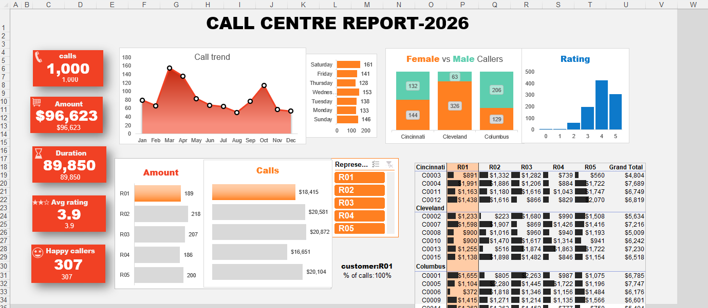

## 📊 Call Centre Report 2026

## 📌 Project Overview

The **Call Centre Report 2026** is an interactive dashboard created using **Microsoft Excel** to analyze call centre performance and customer-related data.

The dashboard provides a clear overview of important business metrics such as the total number of calls, total amount, call duration, customer ratings, happy callers, representative performance, and customer demographics.

This project demonstrates how **Excel, Pivot Tables, Pivot Charts, slicers, and data visualization techniques** can be used to transform raw call centre data into meaningful business insights.

---

## 🎯 Objectives

- Analyze overall call centre performance.
- Track the number of calls received.
- Analyze the total amount generated.
- Understand call duration and customer satisfaction.
- Compare male and female callers.
- Analyze customer ratings.
- Compare the performance of different representatives.
- Identify call trends across different months and days.
- Compare performance across different cities.

---

## 📈 Dashboard Highlights

The dashboard includes the following key performance indicators:

### 🔹 Key Metrics

- **Total Calls:** 1,000
- **Total Amount:** $96,623
- **Total Duration:** 89,850
- **Average Rating:** 3.9
- **Happy Callers:** 307

### 🔹 Visualizations

The dashboard contains:

- 📞 **Call Trend** – Shows the monthly trend of calls.
- 👨‍💼 **Representative Performance** – Compares calls and amount handled by representatives.
- 👩‍🦱👨 **Female vs Male Callers** – Shows caller distribution across cities.
- ⭐ **Customer Rating** – Displays the distribution of customer ratings.
- 📅 **Day-wise Call Analysis** – Shows calls received on different days.
- 💰 **Amount Analysis** – Compares the amount generated by representatives.
- 🏙️ **City-wise Analysis** – Provides detailed information for Cincinnati, Cleveland, and Columbus.
- 🎛️ **Interactive Filters/Slicers** – Allows users to filter the dashboard based on representatives and other categories.

---

## 🛠️ Tools & Technologies

- **Microsoft Excel**
- Pivot Tables
- Pivot Charts
- Excel Slicers
- Excel Formulas
- Data Cleaning
- Data Analysis
- Data Visualization
- Dashboard Design

---

## 📂 Repository Contents

| File | Description |
|------|-------------|
| `Call_Centre_Report.xlsx` | Excel workbook containing the complete dashboard and analysis |
| `Call_Centre_Report.png` | Preview image of the dashboard |
| `README.md` | Project documentation |

---

## 🔍 Key Insights

From the dashboard, we can observe:

- The dataset contains **1,000 calls**.
- The total amount generated is approximately **$96.6K**.
- The average customer rating is **3.9 out of 5**.
- There are **307 happy callers**.
- Call volume varies across different months.
- Customer and call performance can be compared between different representatives.
- The dashboard allows comparison of caller demographics across different cities.
- Customer ratings provide an overview of overall customer satisfaction.

---

## 💡 Business Value

This dashboard can help call centre managers:

- Monitor employee performance.
- Identify changes in call volume.
- Understand customer satisfaction.
- Track revenue generated from calls.
- Identify high-performing representatives.
- Compare performance across locations.
- Make data-driven business decisions.

---

## 🖥️ Dashboard Preview

---

## 🚀 Future Improvements

The project can be further improved by:

- Adding more advanced KPIs.
- Including year-over-year performance analysis.
- Adding automated data refresh.
- Creating additional customer satisfaction metrics.
- Integrating the dashboard with Power BI.
- Adding predictive analysis for future call volumes.

---
